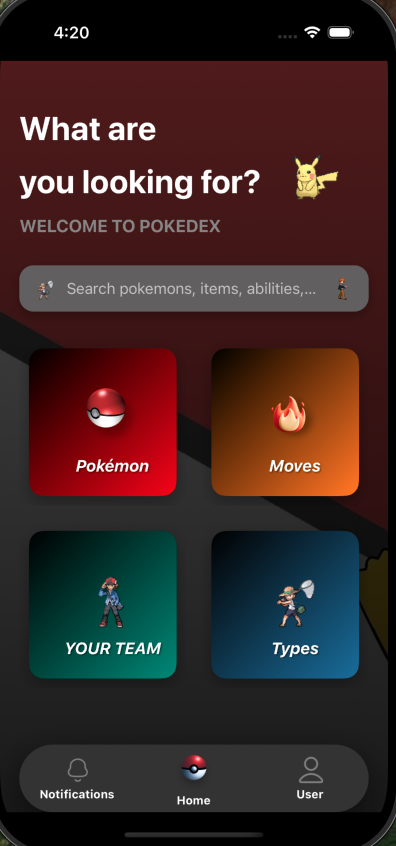
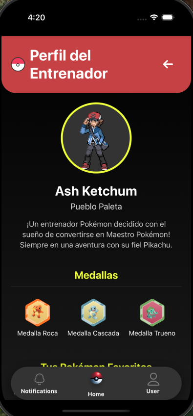
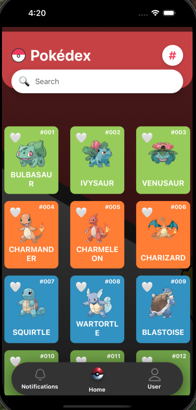
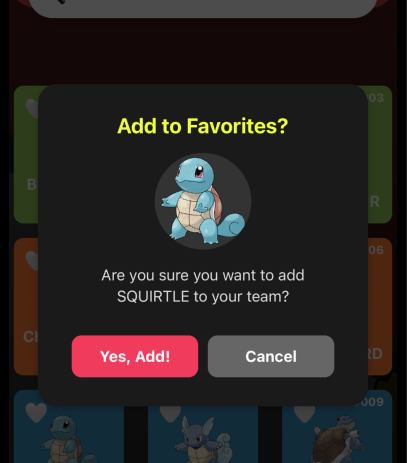
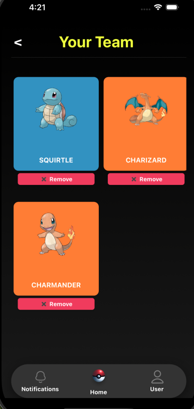
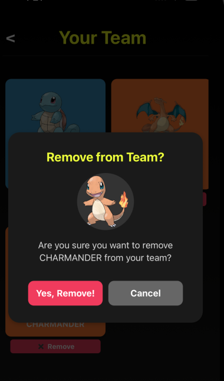
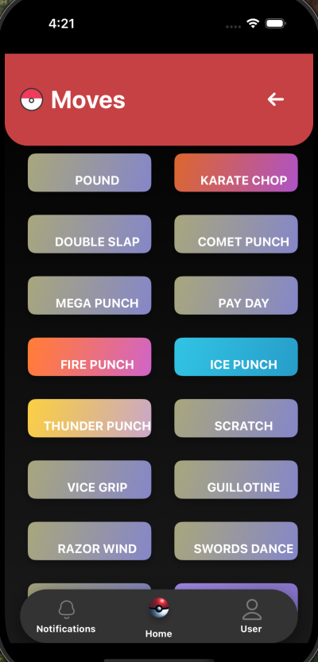
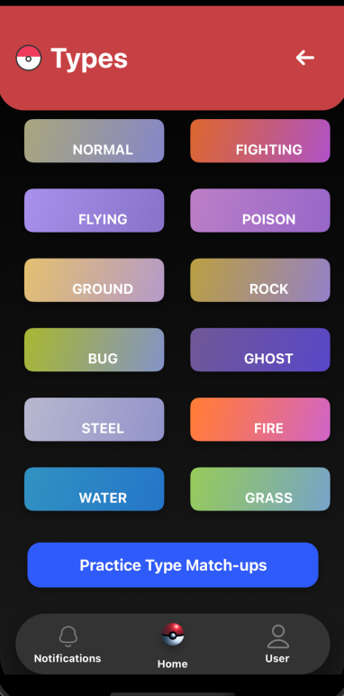
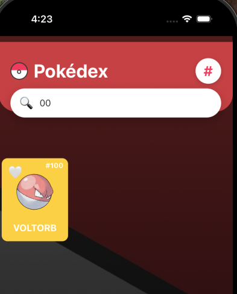
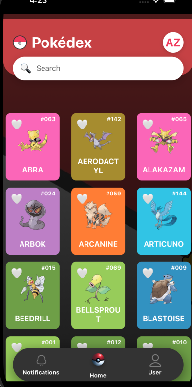

# AssureDex: A Comprehensive React Native Pokémon Guide

Welcome to **AssureDex**, a robust and feature‑rich React Native application designed to serve as your ultimate companion in the Pokémon universe. This app provides a modern and intuitive interface to explore various aspects of the Pokémon world—from detailed creature data to move sets, abilities, and locations.

[**▶️ Watch the demo video**](https://go.screenpal.com/watch/cT1tDhnlVzy)   |   [**🖌 Figma prototype**](https://www.figma.com/design/9FADFspYyJxWqrymG1fRop/Pokemon-Mobile-App-Exploration--Community-?node-id=1-204&p=f&t=wDKozekFP6uFthMq-0)

---

## Table of Contents

- [Features](#features)  
- [Prerequisites](#prerequisites)  
- [Installation](#installation)  
- [Running the App](#running-the-app)  
- [Project Structure](#project-structure)  
- [Visuals](#visuals)  
- [Dependencies](#dependencies)  
- [Acknowledgements](#acknowledgements)  
- [Troubleshooting](#troubleshooting)  
- [License](#license)  

---

## Features

AssureDex offers a range of functionalities to enhance your Pokémon journey:

* **Pokédex:** Comprehensive browsing and search capabilities for Pokémon, including detailed information such as IDs, types, and images.  
* **Moves:** An extensive database to explore various Pokémon moves.  
* **Abilities:** Detailed insights into different Pokémon abilities.  
* **Items:** A catalog of items found within the Pokémon world.  
* **Evolution Lines:** Dedicated section to understand Pokémon evolution paths.  
* **Locations:** *(Coming Soon)* A guide to various regions and significant places.  
* **Natures:** Information on how different natures affect Pokémon stats.  
* **Type Chart:** A detailed reference for Pokémon type effectiveness.  
* **Universal Search:** A powerful search bar allowing queries across multiple categories (Pokémon, Moves, Abilities, Items).  
* **Clean User Interface:** Features a modern and intuitive design with vibrant gradients, custom icons, and fluid animations powered by `react-native-reanimated`.  
* **Persistent Bottom Navigation:** A reusable footer component for consistent navigation across key sections (Home, Notifications, User Profile).  

---

## Prerequisites

Before setting up the project, ensure your development environment meets the following requirements:

* **Node.js (LTS version ≥ 18):** Download from [nodejs.org](https://nodejs.org/).  
* **npm** (comes with Node.js) or **Yarn**.  
* **React Native CLI:**
  ```bash
  npm install -g react-native-cli
  # OR if using Yarn:
  # yarn global add react-native-cli
Xcode (for iOS development) — install from the Mac App Store.

Ensure Command Line Tools are installed:

bash
Copiar
Editar
xcode-select --install
CocoaPods (for iOS native dependencies):

bash
Copiar
Editar
sudo gem install cocoapods
Android Studio (for Android development) — required for Android SDK, platform tools, and setting up an emulator. See the React Native environment setup guide for details.

Installation
Follow these steps to get AssureDex up and running on your local machine:

Clone the repository

bash
Copiar
Editar
git clone https://github.com/legs30011/Assuresoft-ReactNative-App.git
cd Assuresoft-ReactNative-App
Install JavaScript dependencies

bash
Copiar
Editar
npm install         # or: yarn install
Install iOS native dependencies (CocoaPods)

bash
Copiar
Editar
cd ios
pod install
cd ..
Configure react-native-vector-icons (crucial for icons)

a. Create/verify react-native.config.js

javascript
Copiar
Editar
// react-native.config.js
module.exports = {
  assets: [
    './node_modules/react-native-vector-icons/Fonts/', // required
    './assets/fonts/',                                 // optional custom fonts
  ],
};
b. Verify babel.config.js

javascript
Copiar
Editar
// babel.config.js
module.exports = {
  presets: ['module:@react-native/babel-preset'],
  plugins: [
    'react-native-reanimated/plugin', // always last
  ],
};
c. Autolink fonts

bash
Copiar
Editar
npx react-native link
d. If icons still don’t appear (iOS) — follow the manual steps in Xcode:

Add the .ttf files to Copy Bundle Resources

Add each font file name to the UIAppFonts array in Info.plist

Clean build folder, then rebuild.

Running the App
Start the Metro Bundler

bash
Copiar
Editar
npx react-native start --reset-cache
Run on iOS

bash
Copiar
Editar
npx react-native run-ios
Run on Android

bash
Copiar
Editar
npx react-native run-android
Project Structure
arduino
Copiar
Editar
AssureDex/
├── src/
│   ├── assets/          # images & fonts
│   │   ├── backgrounds/
│   │   ├── icons/
│   │   ├── screenShots/
│   │   └── trainers/
│   ├── components/      # reusable UI
│   ├── navigation/      # RootNavigation.ts
│   ├── sections/        # screens & features
│   │   ├── common/
│   │   ├── context/
│   │   ├── customHeader/
│   │   ├── footer/
│   │   ├── homeScreen/
│   │   ├── locationDetailScreen/
│   │   ├── moves/
│   │   ├── pokemonDetailScreen/
│   │   ├── pokemoninfo/
│   │   ├── profile/
│   │   ├── typeChart/
│   │   └── yourTeam/
│   └── types/
├── App.tsx
├── index.js
├── babel.config.js
├── package.json
├── Podfile
├── react-native.config.js
└── tsconfig.json
Visuals
Examples

Home Screen:


Pokédex Start (List View):


Pokémon Detail Information:


Search by Number:


Search by Word (Name):


Your Team:


Remove Pokémon from Team:


Moves Page:


Types Page:


Search by Number:


Dependencies
Key dependencies utilized in this project (see package.json for full list):

@react-navigation/native — core navigation utilities

@react-navigation/native-stack — native stack navigator

@react-navigation/stack — (deprecated) legacy stack navigator

axios — promise‑based HTTP client

react / react‑native — core frameworks

react-native-gesture-handler — native‑driven gestures

react-native-linear-gradient — gradient backgrounds

react-native-progress — progress indicators

react-native-reanimated — performant animations

react-native-reanimated-carousel — animated carousels

react-native-safe-area-context — safe‑area handling

react-native-screens — screen optimizations

react-native-vector-icons — icon fonts

react-native-svg — SVG rendering

Acknowledgements
PokeAPI — for their free and open Pokémon data.

Troubleshooting
Error / Symptom	Likely Cause	Quick Fix
Text string must be rendered within a <Text> component	Plain text inside <View>	Wrap text in <Text>
Icons show as ? / squares	Fonts not linked	npx react-native link → rebuild; ensure .ttf files added on iOS
requireNativeComponent: 'RNCWebView' was not found	Native module not linked	cd ios && pod install, clean build, restart Metro
Build failures after npm install / pod install	Cache corruption	Perform a full clean: remove node_modules, pod cache, Metro cache, then reinstall

Full clean script (macOS/Linux):

bash
Copiar
Editar
# Close Metro, Xcode, Android Studio
rm -rf node_modules
rm -rf $TMPDIR/metro-* $TMPDIR/haste-map-*
npm cache clean --force

watchman watch-del-all  # if using Watchman

cd ios
rm -rf Pods Podfile.lock
pod install
cd ..

cd android
./gradlew clean
cd ..

npm install            # or yarn
npx react-native start --reset-cache
# then:
npx react-native run-ios     # or run-android
# License:
This project is licensed under the MIT License. See the LICENSE file for details.
